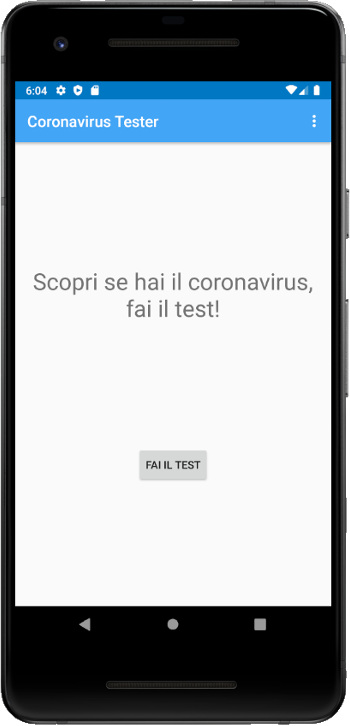
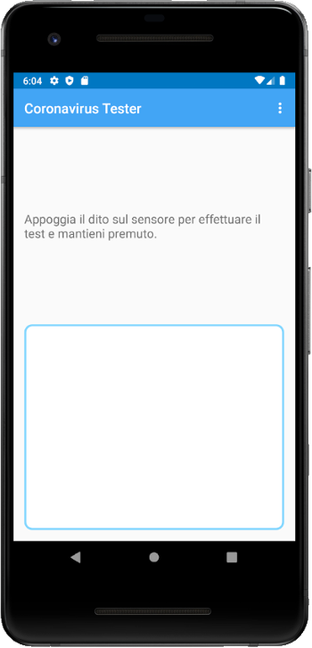
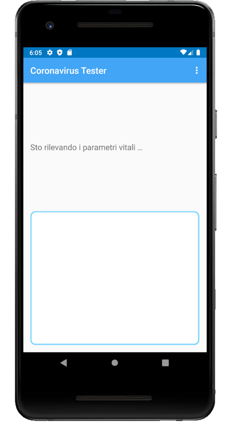
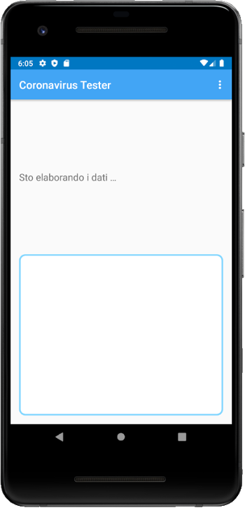

# Coronavirus Fake Tester

   

> Are you affected by COVID-19? Do the test!

Nomore expensive swabs or queues in the emergency room: from now you 
can discover if you are affected by COVID-19 or not.

The only thing you have to do is let *coronavirus-tester* scans your
finger, elaborate the data and let you know if you are affected or not.

    

## 🔑 Key features

- 🚀 Extremely light, about 2 MB.
- ⌛ Tester is very quick: it needs about 10 seconds in order to scan and elaborate data.
- 🆓 Application is completely free.

## Download 

Get it from [https://github.com/lparolari/coronavirus-tester/releases](https://github.com/lparolari/coronavirus-tester/releases).

Download and install the application.

## 👤 Author

**Luca Parolari**

* Github: [@lparolari](https://github.com/lparolari)

## 🤝 Contributing

Contributions, issues and feature requests are welcome! Feel free to check [issues page](https://github.com/lparolari/coronavirus-tester/issues).
The code is short, throughly commented and well tested, so you should feel quite comfortable working on it.
If you have any doubt or suggestion, please open an issue.

## 🦄 Show your support

Give a ⭐️ if this project helped or inspired you!

## 📝 License

Built with ❤️ by [Luca Parolari](https://github.com/lparolari). 
This project is [MIT](https://github.com/lparolari/coronavirus-tester/blob/master/LICENSE) licensed.
